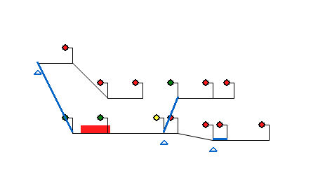

# This is a pygame train simulator.

#### The project is a simple test of how a trains movement can be:
1) tracked against lines (or routes) drawn on the screen
2) haulted or allowed to pass onto the next route - depending on the state of the next signal colour
3) switch to another track, when presented with a point (which allows for a fork in the routes)

### Terminology you will come across in the is project:
 1. Route = is a vector with a start x & y coordinate and end x & y coordinate. This is considered an edge
 2. Path = a collection of routes with no upper bound
 3. Point = stores multiple paths, where only one can be active. Think of it as a switch that be change what path is active. This is considered a node
 4. Journey = a list of routes to follow is a journey

 #### The project

The project has a requirements.txt for all dependencies + a lot more. You should be fine with just the pygame dependency though!

 #### Game controls
 Only one train loads by default. To control the train movement press the space bar. Please press the space bar once
 The train will only move if the next signal on its routes is not red
 Only signals in in the active path can be controlled. This is a limitation in the game
 Once the train reaches the end of its journey - the game will ungracefully crash with an index exception

 There is no objective of the game really

 #### Adding new routes and points
 Please use the test classes provided for point_test and traverse_util_test before trying to add more routes to the main class, as they will help to sanitise routes are OK
 New routes should be added to the 'routes_list' folder at the root of the project

 